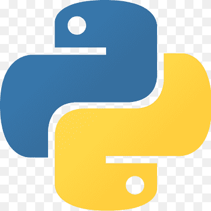
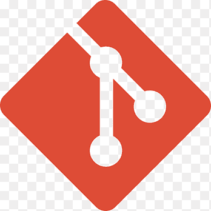
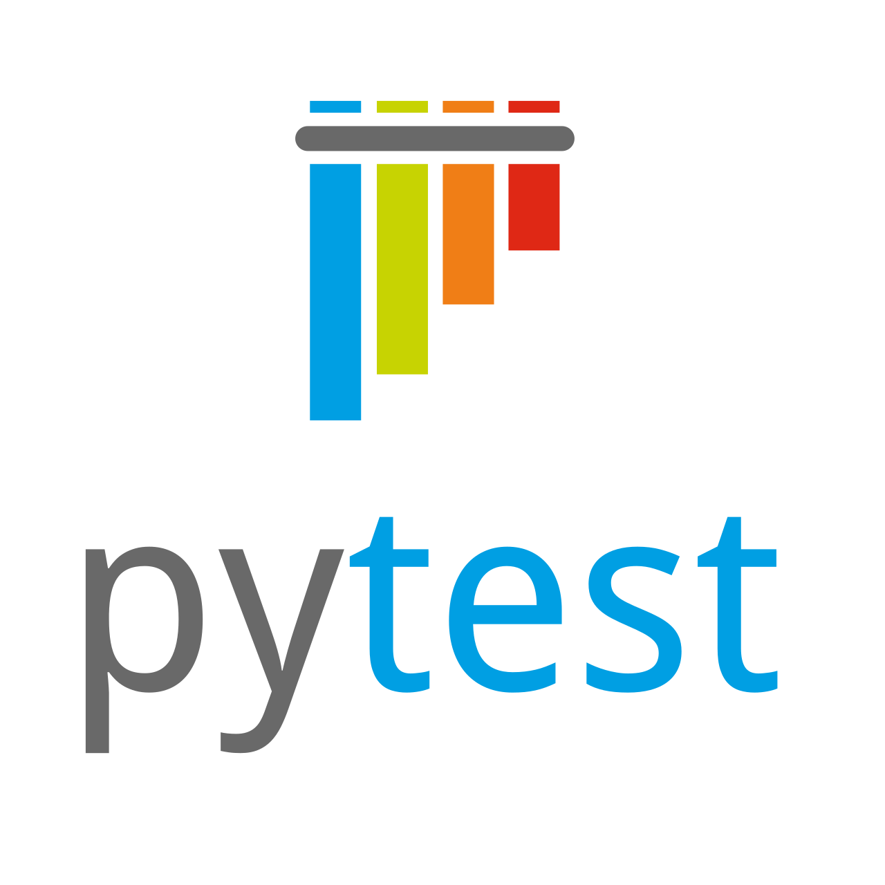
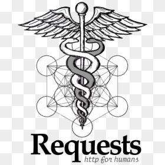
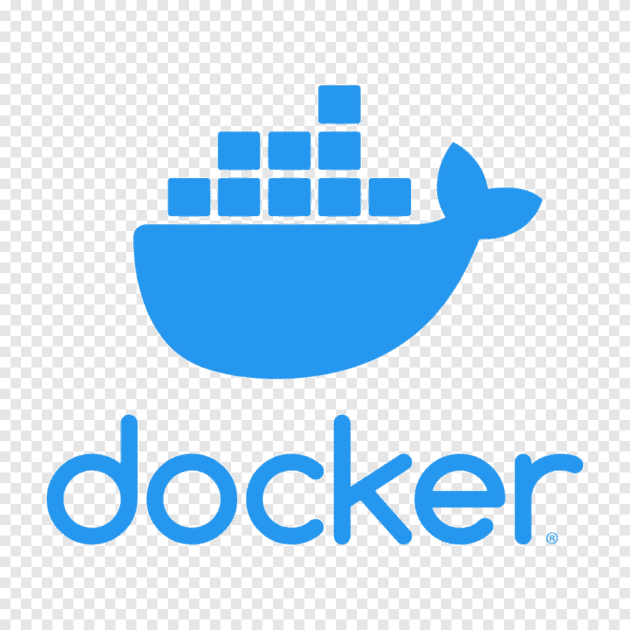
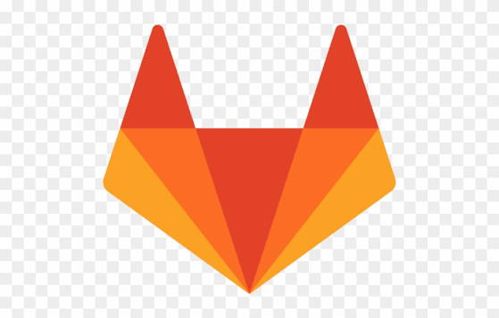
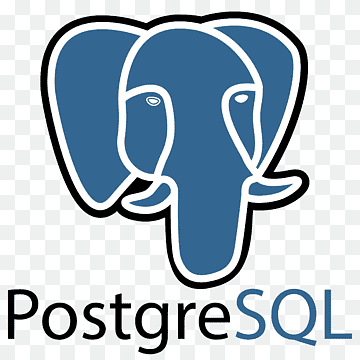
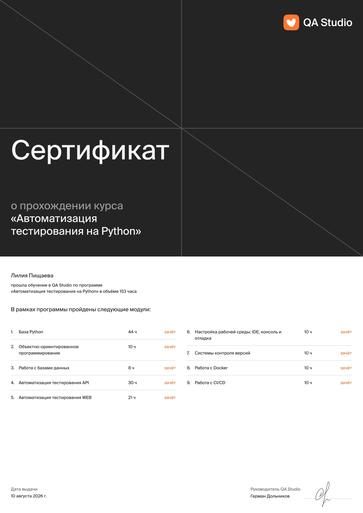
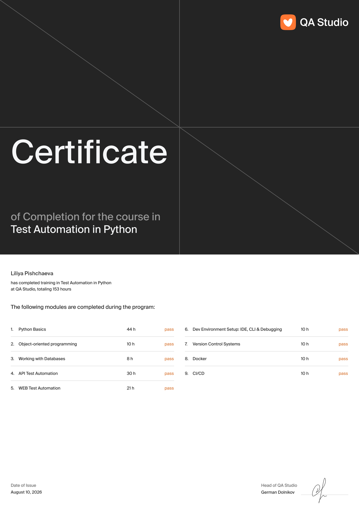

## Привет 👋 Я Лилия

Middle QA Engineer с 6-летним опытом в manual-тестировании веб-приложений. Сейчас расширяю стек — прошла курс автоматизации на Python + Playwright.

### 🔧 Навыки

**Manual QA:** тест-дизайн, чек-листы, тест-кейсы, баг-репорты, функциональное и регрессионное тестирование

**Автоматизация:** Python, pytest, Playwright

**API-тестирование:** Postman, Swagger

**Нагрузочное тестирование:** JMeter, Gatling, K6, LoadRunner

**Инструменты:** Jira, TestRail, SQL, Git, Agile

### 📌 Сейчас

Собираю портфолио pet-проектов по автоматизации — см. закреплённые репозитории ниже.

## Python QA Auto

### Мой стек:

| Python | PyCharm | Git | Pytest | Requests | Playwright | Allure Report | Docker | Gitlab CI | PostgreSQL |
|---|---|---|---|---|---|---|---|---|---|
|  |  |  |  |  |  |  |  |  |  |

### Мои проекты:

| API Битва покемонов | UI Битва покемонов | API My Shows Rating |
|---|---|---|
| [pokemonbattle_api_tests](https://github.com/LiliyaPishchaeva/pokemonbattle_api_tests) | [pokemonbattle_e2e_tests_playwright](https://github.com/LiliyaPishchaeva/pokemonbattle_e2e_tests_playwright) | [myshows_api_tests](https://github.com/LiliyaPishchaeva/myshows_api_tests) |
| Pytest, Requests, Gitlab CI | Playwright, Gitlab CI | Pytest, Requests, Docker |

### 🎓 Обучение

| Сертификат (RU) | Сертификат (EN) |
|---|---|
|  |  |

### 📄 Резюме

[Моё резюме на hh.ru](https://voronezh.hh.ru/resume/6973a97cff0b6406a80039ed1f727247756842)

### 📫 Контакты

- Email: varankina543@mail.ru
- Telegram: [@LiliyaPishchaeva](https://t.me/LiliyaPishchaeva)
